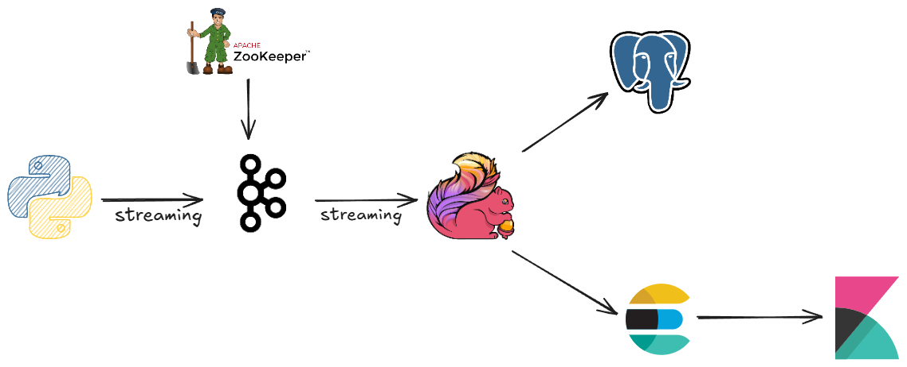

# E-commerce Realtime Streaming System

A comprehensive real-time data streaming and analytics system that processes e-commerce transactions using modern big data technologies. This project demonstrates the implementation of a complete streaming pipeline for processing sales data in real-time.

## 🏗️ Architecture Overview

This system implements a Lambda architecture pattern for real-time analytics on e-commerce transaction data:



## 📊 Data Source

The system uses a **synthetic e-commerce transaction generator** (`SalesTransactionGenerator/main.py`) that creates realistic sales data including:

- **Transaction Details**: Unique transaction ID, timestamps, payment methods
- **Product Information**: Product ID, name, category, price, quantity, brand
- **Customer Data**: Customer ID, transaction amounts
- **Financial Data**: Multi-currency support (USD, EUR, GBP), total amounts

## 🛠️ Tech Stack & Usage

### Core Technologies

1. **Apache Kafka** (Confluent CP 7.4.0)
   - **Purpose**: Message broker for streaming data ingestion
   - **Usage**: Receives transaction data from generator, provides fault-tolerant data streaming
   - **Topic**: `financial_transactions`

2. **Apache Flink** (Stream Processing Engine)
   - **Purpose**: Real-time stream processing and analytics
   - **Usage**: 
     - Consumes data from Kafka
     - Performs real-time aggregations (daily, monthly, category-wise sales)
     - Implements exactly-once processing guarantees
     - Handles fault tolerance with checkpointing (30-second intervals)

3. **PostgreSQL** 
   - **Purpose**: OLTP database for structured data storage
   - **Usage**: Stores processed transaction data and aggregated metrics
   - **Tables Created**:
     - `transactions`: Raw transaction data
     - `sales_per_category`: Category-wise sales aggregation
     - `sales_per_day`: Daily sales totals
     - `sales_per_month`: Monthly sales aggregation

4. **Elasticsearch** (8.11.1)
   - **Purpose**: Search and analytics engine
   - **Usage**: Real-time indexing of transactions for fast querying and analytics
   - **Index**: `transactions`

5. **Kibana** (8.11.1)
   - **Purpose**: Data visualization and dashboard
   - **Usage**: Create real-time dashboards and visualizations from Elasticsearch data

6. **Docker & Docker Compose**
   - **Purpose**: Containerization and orchestration
   - **Usage**: Manages all services with proper resource allocation and health checks

### Supporting Technologies

- **Java 11+** with Maven for Flink application development
- **Python 3.x** with Faker library for data generation
- **Confluent Kafka Python Client** for data production

## 🚀 Getting Started

### Prerequisites
- Docker and Docker Compose
- Java 11+
- Maven
- Python 3.x
- Apache Flink (if running locally)

### Quick Start

1. **Start Infrastructure Services**:
   ```bash
   docker compose up -d
   ```

2. **Build Flink Application**:
   ```bash
   cd flinkcommerce
   mvn clean package
   ```

3. **Start Data Generation**:
   ```bash
   cd SalesTransactionGenerator
   pip install -r requirements.txt
   python main.py
   ```

4. **Submit Flink Job**:
   ```bash
   ./scripts/start.sh
   ```

5. **Access Dashboards**:
   - Kibana: http://localhost:5601
   - Elasticsearch: http://localhost:9200

## 📈 Results & Achievements

### Real-time Analytics Capabilities

1. **Stream Processing Performance**:
   - Processes transactions every 5 seconds with low latency
   - Handles data with exactly-once processing guarantees
   - Implements efficient windowing for time-based aggregations

2. **Data Aggregations Achieved**:
   - **Category-wise Sales**: Real-time sales tracking by product category
   - **Daily Sales Totals**: Complete daily revenue calculation
   - **Monthly Sales Trends**: Long-term business intelligence metrics
   - **Customer Transaction History**: Complete audit trail

3. **System Scalability**:
   - Configurable parallelism (currently optimized for single-node deployment)
   - Resource-optimized Docker containers with CPU and memory limits
   - Efficient batch processing (10,000 records per batch, 10-second intervals)

4. **Data Storage & Retrieval**:
   - **PostgreSQL**: Structured storage with UPSERT operations for data consistency
   - **Elasticsearch**: Fast full-text search and analytics capabilities
   - **Dual-sink Pattern**: Data available in both OLTP and OLAP systems

### Business Intelligence Outcomes

- **Real-time Sales Monitoring**: Track sales performance as transactions occur
- **Category Performance Analysis**: Identify top-performing product categories
- **Trend Analysis**: Monitor daily and monthly sales patterns
- **Customer Behavior Insights**: Analyze purchasing patterns and payment preferences
- **Multi-currency Support**: Handle global e-commerce scenarios

### Technical Achievements

- **Fault Tolerance**: Implemented checkpointing and error handling
- **Data Quality**: Ensured data consistency with conflict resolution (UPSERT operations)
- **Performance Optimization**: Optimized batch sizes and intervals for throughput
- **Monitoring**: Health checks for all services and comprehensive logging
- **Scalability**: Modular architecture supporting horizontal scaling

## 📁 Project Structure

```
├── docker-compose.yml          # Infrastructure orchestration
├── flinkcommerce/             # Flink application
│   ├── src/main/java/
│   │   ├── flinkcommerce/     # Main streaming job
│   │   ├── Dto/               # Data transfer objects
│   │   ├── Deserializer/      # Kafka deserializers
│   │   └── utils/             # Utility classes
│   └── pom.xml                # Maven dependencies
├── SalesTransactionGenerator/ # Data generation
│   ├── main.py               # Transaction generator
│   └── requirements.txt      # Python dependencies

```

## 🔧 Configuration & Optimization

The system is optimized for development and demonstration purposes with:
- Single-node parallelism to prevent resource contention
- Optimized batch sizes for balanced throughput and latency
- Resource-constrained Docker containers for local development
- Comprehensive error handling and retry mechanisms

This project demonstrates proficiency in modern data engineering practices, real-time stream processing, and building scalable data pipelines using industry-standard tools.